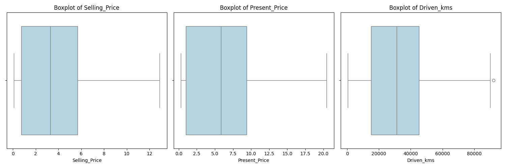
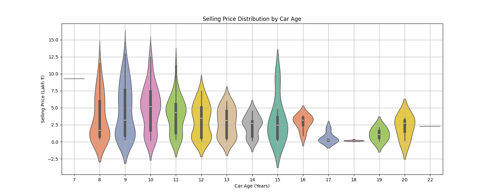

# Car Price Prediction Project

## 📌 Overview
This project predicts the selling price of used cars using supervised machine learning models. The workflow involves end-to-end data science practices including data cleaning, EDA, feature engineering, model training, hyperparameter tuning, and evaluation.

---

## 📂 Dataset
- Source: https://www.kaggle.com/datasets/vijayaadithyanvg/car-price-predictionused-cars
- Contains various features such as:
  - Present_Price
  - Selling_Price
  - Driven_kms
  - Fuel_Type
  - Transmission
  - Owner, etc.

---

## Data Cleaning and Preprocessing
- Null Handling: The data contained no null values.
- Feature engineering: The `Year` column was changed to `Car_Age` as it made the data more useful for analysis.
- Encoding: Encoded non-numerical columns - `Selling Type`, `Transmission`, and `Fuel_Type` using `map()` function
- Feature scaling using `StandardScaler` (especially for SVR)

---

## 🔍 Exploratory Data Analysis
- **Distribution plots to understand feature spread**


- **Outlier detection using the IQR method**
> _These plots clearly show the improvement in distribution after outlier removal._



- **Correlation heatmap**


- **Visuals: Scatter plots, boxplots for categorical relationships**





---

## Training
- **Split**: The cleaned dataset was split in 80-20 split (with 80 being training split)
- **Models Trained**: The following regression models were chosen to train on the cleaned-
   - **Linear Regression**: was chosen as a base model.
   - Ridge and Lasso
   - Decision Tree
   - Random Forest
   - Gradient Boosting
   - Support Vector Regressor

---

## 📈 Evaluation Metrics
- R² Score
- Mean Absolute Error (MAE)
- Root Mean Squared Error (RMSE)

> Model performance comparison was visualized using a heatmap.


**Random Forest Regressor, RBF SVR and Gradient Boosting Regressor were the best performing models.**

---

## 🔧 Hyperparameter Tuning
Used `RandomizedSearchCV` on:
- Random Forest
- Gradient Boosting
- SVR

### Parameter Grid Used
```python
# Random Forest
{
    'n_estimators': [100, 200],
    'max_depth': [None, 10, 20],
    'min_samples_split': [2, 5],
    'min_samples_leaf': [1, 2]
}

# Gradient Boosting
{
    'n_estimators': [100, 200],
    'learning_rate': [0.05, 0.1],
    'max_depth': [3, 5]
}

# SVR
{
    'C': [0.1, 1, 10],
    'epsilon': [0.01, 0.1, 0.5],
    'kernel': ['rbf'],
    'gamma': ['scale', 'auto']
}
```

*Evaluation Metrics After Hyperparameter Tuning*


---

## ✅ Final Model
**Gradient Boosting Regressor** was selected based on:
- Highest R² Score (0.96): Explains 96% of the variance in the selling price — excellent fit.
- Lowest RMSE (0.62): Indicates predictions are closest to actual values (off by Rs. 62k).
- It balances bias and variance better than others.

---

## 📌 Takeaways
- Gradient Boosting outperformed other models
- SVR also performed well but needed feature scaling
- Feature importance helped in model interpretability

---

## 📎 Future Work
- Model deployment using Flask/Streamlit
- Add more features (e.g., brand, location, engine specs)
- Use SHAP/LIME for deeper interpretability

---

## 👨‍💻 Author
* Anshuman Singh
* GitHub: [Anshuman-cs50](https://github.com/Anshuman-cs50)
