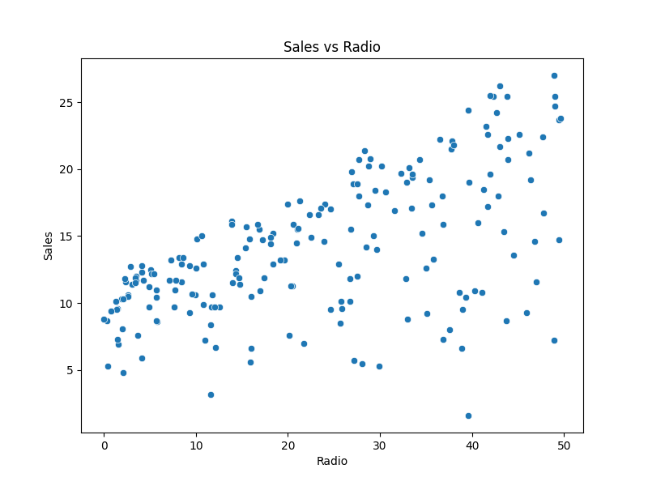

# Car Price Prediction Project

## 📌 Overview
This project focuses on predicting product sales based on various advertising strategies using machine learning techniques in Python. The goal is to build a model that can forecast how much of a product people will purchase depending on advertisement platforms such as Television, Radio, or Newspaper.

---

## 📂 Dataset
- Source: https://www.kaggle.com/datasets/bumba5341/advertisingcsv
- Contains various features such as:
  - TV
  - Radio
  - Newspaper
  - Sales

---

## Data Cleaning and Preprocessing
- Null Handling: The data contained no null values.
- Dropped a non-contributing indexing column.

---

## 🔍 Exploratory Data Analysis

- **Outlier detection using the IQR method**
> _These plots clearly show the improvement in distribution after outlier removal._


- **Correlation heatmap**


- **Visuals: Scatter plots, boxplots for categorical relationships**




---

## Training
- **Split**: The cleaned dataset was split in 80-20 split (with 80 being training split)
- **Models Trained**: The following regression models were chosen to train on the cleaned-
   - Linear Regression
   - Ridge and Lasso
   - Decision Tree
   - Random Forest
   - Gradient Boosting
   - Support Vector Regressor

---

## 📈 Evaluation Metrics
- R² Score
- Mean Absolute Error (MAE)
- Root Mean Squared Error (RMSE)

> Model performance comparison was visualized using a heatmap.


**Random Forest Regressor was chosen as the best performing model.**

---

## 🔧 Hyperparameter Tuning
Used `RandomizedSearchCV` on:
- Random Forest
- Gradient Boosting
- SVR

### Parameter Grid Used
```python

param_grid = {
    'n_estimators': [50, 100, 200],
    'max_depth': [None, 10, 20, 30],
    'min_samples_split': [2, 5, 10],
    'min_samples_leaf': [1, 2, 4]
}

```

*Evaluation Metrics After Hyperparameter Tuning*

```python
{
    'MAE': 0.49957500000000205, 
    'RMSE': 0.6068478598462729, 
    'R2 Score': 0.9864224839712274
}
```

*Best Hyperparameters*

```python
{
    'max_depth': None, 
    'min_samples_leaf': 1, 
    'min_samples_split': 2, 
    'n_estimators': 100
}
```

---

## 👨‍💻 Author
* Anshuman Singh
* GitHub: [Anshuman-cs50](https://github.com/Anshuman-cs50)
